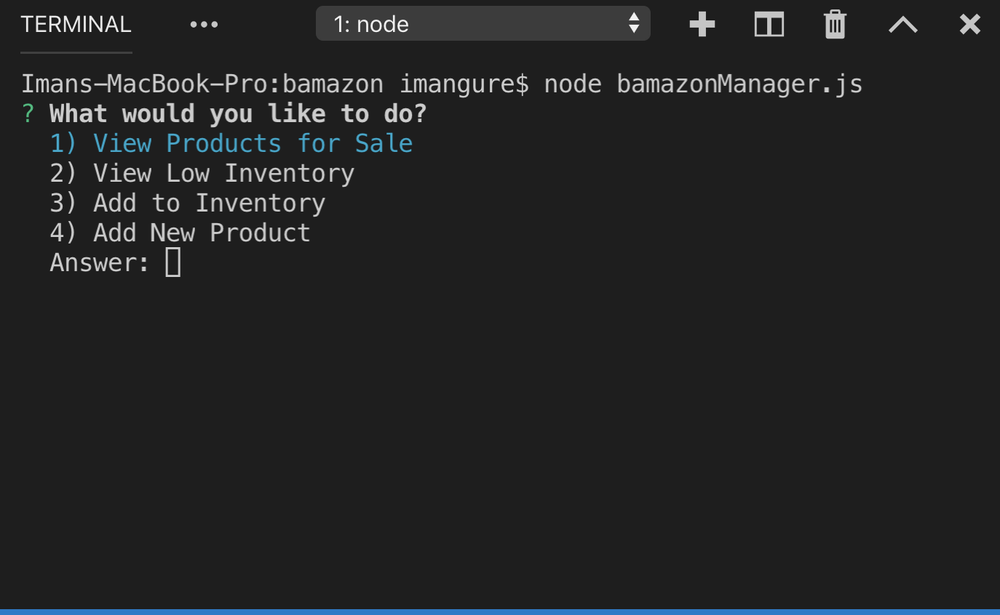
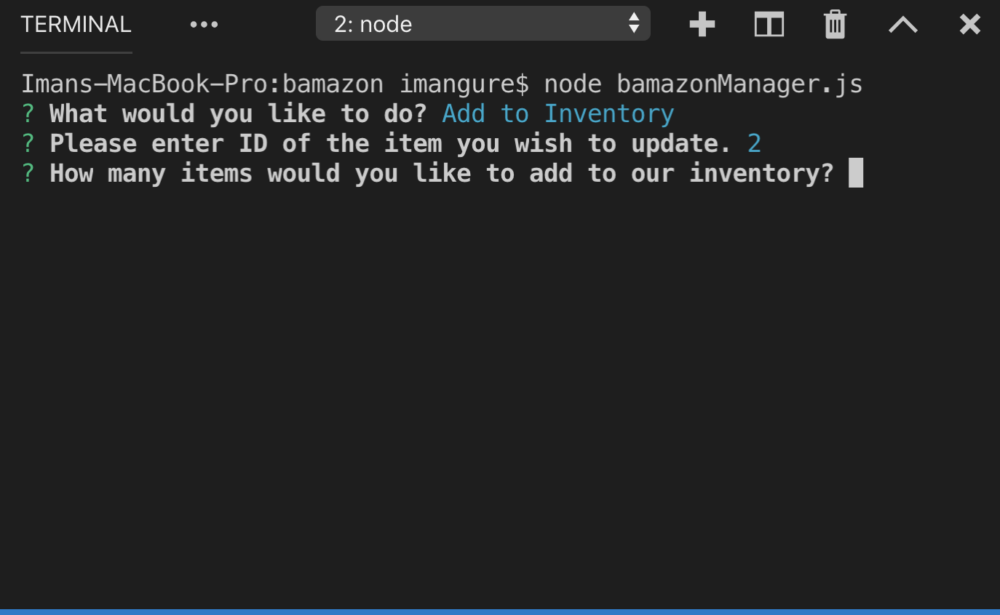

# bamazon

Bamazon is a CRM that focuses on sales. It provides command-line interfaces for customers.

Technologies Used
  
Node.js

Inquirer NPM Package

MySQL NPM Package

Console.table NPM Package

cli-table   NPM Package

##How to Run

To run Bamazon, you will need Terminal, Node, npm, and MySQL Workbench.

1. In Terminal, type git clone git@github.com:github.com:ImanGurey/bamazon.git to download Bamazon.

2. Then, type cd bamazon; npm install to download the required packages.

3. In MySQL Workbench, connect to localhost:3306 and run bamazon_schema.sql then bamazon_seeds.sql.

4. Finally, in Bash, type node bamazonCustomer.js to log in as a customer, node bamazonManager.js as a manager, and node bamazonSupervisor.js as a supervisor.

Demos - Customer

As a customer, you can check items (products) that are for sale and buy them.

To buy an item, enter the item ID and quantity. You will get the subtotal.

Note, you can buy an item only up to the stock quantity.

At the end, you can see all items that you purchased.

Demos - Manager

The manager interface allows the user to:

To use the customer interface, simply type node bamazonManager.js in Terminal.

1. View Products for Sale

2. Add to Inventory (Takes current inventory and updates quantity)

3. Add New Product (Create and a new entry to the mySQL database)

